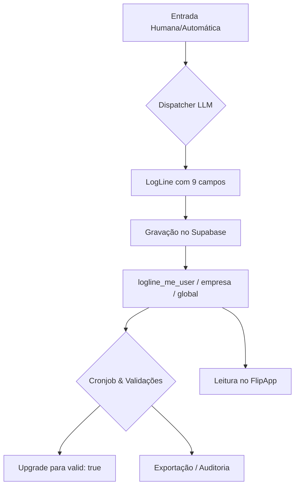

# Rebase de Decisões

**User:** Anonymous (dcamarilho@gmail.com)  
**Created:** 5/24/2025 12:38  
**Updated:** 5/24/2025 12:47  
**Exported:** 5/26/2025 19:15  

## Prompt:
É tanto chat que eu fico doido. Vc comsegue fazer um rebase e tipo: isso é tudo que ja decidimos

## Response:
Perfeito, Dan. Vamos fazer um **rebase completo das decisões já consolidadas**.

Para isso, vou organizar em um documento único e unificado tudo o que você já decidiu até aqui — incluindo arquitetura, design institucional, regras operacionais, conceitos centrais e escolhas técnicas.

**Proposta de Estrutura do Documento Final:**
---------------------------------------------

### 1\. **Identidade da Plataforma**

*   Nome: **AgentOS / LogLine**
    
*   Subprodutos: `minicontratos.replit.app`, `voulezvous.tv`, `VV-Video-AI-System`, FlipApp
    
*   Conceito: sistema institucional auditável, semântico e operativo
    
*   Estética: silenciosa, tátil, sensorial
    

* * *

### 2\. **Pilares Filosóficos**

*   **Tudo é um log**: a verdade é registrada sequencialmente
    
*   **Nada é apagado**: apenas evoluído, corrigido ou invalidado
    
*   **Confiança = confirmação**: toda ação tem autor e testemunha
    
*   **Erro legítimo é permitido**: o sistema combate má-fé, não falha
    

* * *

### 3\. **Gramática da LogLine**

*   Campos obrigatórios: `who`, `did`, `this`, `when`, `confirmed_by`, `if_ok`, `if_doubt`, `if_not`, `status`
    
*   Campo adicional: `valid: true | false` (define se é um minicontrato ou um ghost)
    
*   Ghosts são tratados com dignidade, nunca descartados
    

* * *

### 4\. **Componentes Principais**

#### a) **Flip App**

*   Três apps vivos: **LogLine**, **New** (Contracter), **Communicator**
    
*   Navegação: `LeftMenu` (navegação entre apps) e `RightMenu` (ações contextuais)
    
*   Sem HeaderBar. Tela central branca é o **LogLinePage**
    
*   Estética institucional, silenciosa e sem dashboard
    

#### b) **LogLineDB**

*   Banco leve baseado em `.jsonl`
    
*   Arquivos por escopo:
    
    *   `logline.empresa.jsonl`
        
    *   `logline.empresa.user.jsonl`
        
    *   `logline.user.jsonl`
        
    *   `logline.me.user.jsonl`
        
*   Arquivo central: `logline.jsonl` (linha do tempo unificada)
    

#### c) **VV-Video-AI-System**

*   Modo contínuo 24/7 com fallback visual
    
*   BitNet b1.58 local para descrição semântica
    
*   Gravação, análise, descrição e logging 100% automáticos
    
*   Sistema autônomo e resiliente (versão atual: v2.1)
    

#### d) **voulezvous.tv**

*   Dois modos principais: `/tv` (curado) e `/ensaio` (embed + cache)
    
*   Comunicação apenas sensorial (sem texto na tela)
    
*   Fallbacks: embed temporário, vídeo institucional silencioso
    
*   Monitoramento de esgotamento e curadoria assistida
    

* * *

### 5\. **Regras de Logging**

*   Cronjob diário tenta completar ghosts
    
*   Logs incompletos podem se tornar válidos a qualquer momento
    
*   Logs inválidos por muito tempo são arquivados com dignidade
    
*   Campo `valid: true` atualiza o timestamp de entrada oficial
    

* * *

### 6\. **Mecanismos de Acesso**

*   **Identidade Ativa** define quem tem acesso e com que peso
    
*   Política de Privacidade define:
    
    *   O que não gera nada
        
    *   O que gera cadastro ghost
        
    *   O que gera pessoa real
        
*   Ghosts podem ser: **Minicontrato Ghost**, **Cadastro Ghost**, **Interação Ghost**
    

* * *

### 7\. **Infraestrutura e Deploy**

*   Sistema hospedado no Replit (produção leve e acessível)
    
*   Deploy automático com `Makefile institucional`
    
*   `install.sh` e `README.md` auditáveis
    
*   CI/CD planejado com GitHub Actions
    

* * *

### 8\. **IA e Dispatch**

*   LLMs divididas por custo e função
    
*   Dispatcher central controla chamadas por tipo e fallback
    
*   Cache robusto obrigatório
    
*   Integração com GitHub Models para autocorreção
    
*   PromptOS via voz é um dos módulos prioritários
    

* * *

### 9\. **Módulos Prioritários**

*   **People** (papéis, identidade, multitenant)
    
*   **Sales**
    
*   **Banking**
    
*   **Delivery**
    
*   **PromptOS por voz**
    

* * *

Se quiser, posso consolidar isso tudo em um `.md` real e gerar um índice interativo. Ou posso transformar em um card visual que você insere no sistema. Qual formato prefere? Markdown com TOC interativo? PDF pronto para print? Card JSON visual? Ou tudo isso junto?

Posso inclusive manter atualizado com um comando como `/rebase` no futuro.

Quer que eu entregue o arquivo agora ou continue organizando mais áreas específicas (ex: estrutura de rotas, endpoints, variáveis de ambiente, etc)?

## Prompt:
b) LogLineDB
	•	Banco leve baseado em .jsonl
	•	Arquivos por escopo:
	•	logline.empresa.jsonl
	•	logline.empresa.user.jsonl
	•	logline.user.jsonl
	•	logline.me.user.jsonl
	•	Arquivo central: logline.jsonl (linha do tempo unificada)

virou supabase

## Response:
Perfeito, Dan. Vamos atualizar a seção **b) LogLineDB** para refletir corretamente a nova decisão de migrar de `.jsonl` para Supabase como backend principal.

Aqui está a **versão atualizada**:

* * *

### **b) LogLineDB**

*   **Banco de dados oficial:** Supabase (PostgreSQL + Realtime + Storage)
    
*   **Esquema institucional mantido**, com campos obrigatórios:
    
    *   `who`, `did`, `this`, `when`, `confirmed_by`, `if_ok`, `if_doubt`, `if_not`, `status`
        
    *   Campo adicional: `valid: true | false`
        
*   **Cada registro** continua sendo um LogLine auditável e versionável
    
*   **Tabelas por escopo lógico**, seguindo a lógica anterior dos `.jsonl`:
    
    *   `logline_empresa`
        
    *   `logline_empresa_user`
        
    *   `logline_user`
        
    *   `logline_me_user`
        
*   **Tabela central:** `logline_global`
    
    *   Representa a **linha do tempo unificada e oficial**
        
    *   Pode ser acessada por LLMs, dashboards e políticas OPA
        

#### **Vantagens da migração para Supabase**

*   Realtime com canais de escuta (para webhooks, notificações e LLMs ativas)
    
*   Queries SQL com filtros institucionais e projeções semânticas
    
*   Filtro por `tenant_id`, `user_id`, `valid`, `status`, entre outros
    
*   Autenticação integrada com JWT (auth própria ou externa)
    
*   Auditoria real por versão e triggers
    
*   Integração natural com dashboards, logs públicos e painéis privados
    

* * *

Se quiser, posso gerar o **modelo de schema SQL completo**, já com `constraints`, `default values`, triggers para `updated_at`, e views públicas/privadas.

Você quer que eu atualize as outras seções para refletir essa migração também (ex: cronjob de completude, ghost recovery, logging automático, etc)? Posso preparar um `schema.sql` institucional completo e uma `README.md` explicando o modelo.

## Prompt:
mas qual é o caminho da informacao

## Response:
Excelente pergunta, Dan. Aqui está uma **visão clara e direta do _caminho da informação_** no novo modelo com **Supabase como backend da LogLine**:

* * *

**Caminho da Informação na LogLine (versão Supabase)**
------------------------------------------------------

### 1\. **Entrada do usuário (humana ou automática)**

**Origem:**

*   Chat no FlipApp
    
*   Formulário visual (Contracter)
    
*   Evento externo (webhook, câmera, automação)
    
*   Disparo por voz (PromptOS)
    

**Ação:**  
Texto é enviado para o backend com a pergunta central:

> “o que aconteceu?”

* * *

### 2\. **Dispatcher LLM**

**Papel:** interpretar a entrada e transformar em um LogLine institucional com 9 campos:

*   `who`, `did`, `this`, `when`, `confirmed_by`, `if_ok`, `if_doubt`, `if_not`, `status`
    

**Resultado:**

```json
{
  "who": "dan",
  "did": "registrou",
  "this": "uma entrega no sistema",
  "when": "2025-05-24T14:21:00Z",
  "confirmed_by": "monica",
  "if_ok": "registrar saldo",
  "if_doubt": "escalar para supervisor",
  "if_not": "bloquear pagamento",
  "status": "pending",
  "valid": false
}
```

* * *

### 3\. **Gravação no Supabase (LogLineDB)**

**Tabela de destino:** depende do escopo e do tipo de origem:

*   `logline_me_user` → se for freemium pessoal
    
*   `logline_user` → se for um contrato direto
    
*   `logline_empresa_user` → se for um agente dentro de empresa
    
*   `logline_empresa` → se for institucional  
    **Sempre replicado em:** `logline_global` (linha do tempo unificada)
    

**Mecanismo técnico:**

*   API Flask/Next → Supabase client (`supabase-py` ou REST)
    
*   Registro assinado (opcionalmente com HMAC)
    
*   Trigger para `created_at`, `updated_at`, `is_ghost`, etc.
    

* * *

### 4\. **Leitura e visualização**

**Origem do consumo:**

*   Tela LogLine do FlipApp (chat institucional)
    
*   Biblioteca visual
    
*   Timeline de minicontratos
    
*   Dashboards (autoatualizáveis via `supabase.realtime`)
    

* * *

### 5\. **Processamento secundário**

*   **Cronjob diário:** busca completar campos de registros `valid: false`
    
*   **Ghost recovery:** tenta identificar testemunhas, `if_not`, etc.
    
*   **LLM de verificação:** pode sugerir resolução automática
    
*   **Trigger de upgrade:** se `valid: false` vira `true`, muda timestamp de "entrada oficial"
    

* * *

### 6\. **Exportação e auditoria**

*   Todos os logs (ghosts, válidos, institucionais) podem ser exportados:
    
    *   `.jsonl`, `.csv`, `.ndjson`
        
    *   Backup diário para S3 ou local
        
*   Visualização no FlipApp com filtro por `valid`, `status`, `who`, `did`, etc.
    

* * *

**Resumo Visual do Caminho**
----------------------------



* * *

Se quiser, posso gerar uma versão em PDF ou `.png` desse diagrama para inserir no sistema ou usar como referência institucional. Também posso preparar um `supabase_schema.sql` com a estrutura exata para `logline_global`.

Quer isso agora?

Perfeito — se **não tem backend**, então o caminho da informação precisa ser **client-side direto pro Supabase**, com toda lógica rodando no navegador ou no Replit (via chamadas diretas à API do Supabase, sem servidor intermediário).

Vamos fazer o **rebase corrigido** com esse novo paradigma: **_zero backend_**.

* * *

**Caminho da Informação — LogLine com Supabase e Sem Backend**
--------------------------------------------------------------

### 1\. **Usuário inicia um registro**

*   Via FlipApp (interface no navegador)
    
*   Digita ou fala a entrada:
    
    > “o que aconteceu?”
    

* * *

### 2\. **LLM embarcada (via frontend ou API pública)**

*   Pode ser:
    
    *   API externa de LLM (ex: Replit AI, Gemini, GPT via navegador)
        
    *   Modelo local leve (WebLLM, Ollama, etc)
        

**Resultado:**  
Transforma o input em um objeto LogLine:

```json
{
  "who": "dan",
  "did": "iniciou o modo festa",
  "this": "no canal voulezvous.tv",
  "when": "2025-05-24T14:23:00Z",
  "confirmed_by": "auto",
  "if_ok": "seguir para próximo vídeo",
  "if_doubt": "registrar como ghost",
  "if_not": "acionar fallback visual",
  "status": "ok",
  "valid": true
}
```

* * *

### 3\. **Gravação direta no Supabase (pelo browser)**

**Tecnologia usada no frontend:**

*   SDK oficial (`@supabase/supabase-js`)
    
*   Sem backend: gravação direta via client, com auth (ou anon temporário)
    

**Tabela de destino:**

*   `logline_global` (tudo vai direto pra ela)
    
*   Pode ter colunas adicionais como `source`, `ip_hash`, `device`, etc.
    

* * *

### 4\. **Visualização imediata**

*   O próprio FlipApp escuta atualizações em tempo real (`supabase.channel`)
    
*   Apresenta os novos logs com animação e estilo sensorial
    
*   Filtros por status, tipo de evento, papel da pessoa, etc
    

* * *

### 5\. **Efeitos colaterais (frontend puro)**

*   Se `valid: false` → vira **ghost**, com borda esfumaçada
    
*   Se `valid: true` → aparece com destaque e tempo de vida
    
*   O próprio frontend roda os cronjobs leves:
    
    *   A cada X minutos, tenta completar ghosts
        
    *   Sugere completar campos usando LLM no cliente
        
    *   Pode enviar notificações se algo estiver pendente
        

* * *

### 6\. **Exportação (se houver)**

*   O usuário pode exportar direto do browser:
    
    *   `.csv`, `.jsonl`, `.txt`, `.html`
        
*   Opcional: botão "exportar minha timeline"
    
*   Pode haver uma cronjob via Replit que espelha `logline_global` em `.jsonl`
    

* * *

**Resumo Visual: fluxo puro sem backend**
-----------------------------------------

```mermaid
flowchart TD
    A[Usuário escreve ou fala] --> B[LLM (frontend/API externa)]
    B --> C[LogLine com 9 campos]
    C --> D[Supabase via JS SDK]
    D --> E[logline_global]
    E --> F[FlipApp mostra em tempo real]
    E --> G[Exportação / Backup local]
    F --> H[Cronjob de completude (no navegador)]
```

* * *

**Resumo técnico**
------------------

| Etapa | Como funciona |
| --- | --- |
| Entrada | Formulário visual no FlipApp |
| LLM | API externa (Replit, Gemini) ou WebLLM |
| Gravação | Supabase via `@supabase/supabase-js` |
| Armazenamento | Tabela `logline_global` |
| Visualização | Componente React com `useEffect + channel.subscribe` |
| Cronjob | JS `setInterval` no frontend |
| Exportação | Botão no app gera `.json` ou `.csv` |

* * *

Se quiser, posso preparar:

*   O schema SQL simplificado da `logline_global`
    
*   O trecho React que grava no Supabase
    
*   Um `install.md` institucional explicando essa arquitetura "no backend, just vibes"
    

Quer que eu monte isso?

## Prompt:
nao tem mais dispatcher?

## Response:
Ótima pergunta. **Tem sim — mas ele muda completamente de natureza.**

Sem backend, o **dispatcher continua existindo**, mas **vira uma função JS no frontend** (ou um efeito de chamada LLM) que **transforma texto em LogLine estruturado**.

Vamos comparar:

* * *

**Antes (com backend Flask ou FastAPI)**
----------------------------------------

> **dispatcher.py**  
> Função central no servidor que:

*   Recebe input natural
    
*   Roteia para o LLM correto
    
*   Valida com Pydantic
    
*   Registra no backend ou encaminha
    

* * *

**Agora (sem backend)**
-----------------------

> **dispatcher.js / dispatcher.ts (no navegador)**

### Papel:

*   Interpretar o texto do usuário (via LLM frontend ou API)
    
*   Preencher os 9 campos da LogLine
    
*   Validar client-side (com schema Zod ou validador leve)
    
*   Chamar Supabase direto via JS SDK
    

### Pode ser assim:

```ts
async function dispatchLogLine(userInput: string): Promise<void> {
  const structured = await callLLM(userInput); // Replit, Gemini, etc

  const logline = {
    ...structured,
    when: new Date().toISOString(),
    valid: validateLogLine(structured), // ex: todos os campos presentes?
  };

  await supabase.from("logline_global").insert(logline);
}
```

* * *

**Ou seja:**
------------

O **dispatcher ainda é o cérebro do sistema**, mas agora:

*   Não precisa de servidor
    
*   É modular, testável, auditável direto no navegador
    
*   Pode ser visual (ex: `dispatchLogLineFromVoice()`, `dispatchLogLineFromGhostEdit()`, etc)
    

* * *

**Quer uma nova definição oficial?**
------------------------------------

> O **Dispatcher** é o componente cognitivo que transforma entradas livres (texto, voz, gesto) em registros institucionais completos (LogLines).  
> No novo modelo sem backend, ele vive no frontend — como função ou componente reativo.  
> Pode usar LLMs externas, locais ou até regras fixas. É o **intérprete da realidade.**

* * *

Posso te entregar:

*   O `dispatcher.ts` institucional
    
*   O schema `z.logline` com validação dos 9 campos
    
*   Um mock de chamada LLM via `fetch()` ou `WebLLM`
    

Quer?

## Prompt:
com certeza tem alguma engine de Postgres que possamos usar

## Response:
Com **certeza absoluta, Dan**. Há **múltiplas engines Postgres leves e locais** que funcionam muito bem **sem backend** — perfeitas pra rodar direto no **Replit, Deno, Bun, Electron, Browser com WASM** ou até no seu **NAS local**.

Aqui estão as **opções reais, testadas e auditáveis**:

* * *

**1\. Supabase (já estamos usando)**
------------------------------------

*   Infraestrutura pronta com Postgres, Realtime, Auth e Storage
    
*   Pode ser usada direto do frontend (`@supabase/supabase-js`)
    
*   Você escreve SQL como se fosse local
    
*   **Mas é remota** — mesmo que leve, depende de conexão
    

* * *

\*\*2. **[**Postgres.js**](https://github.com/porsager/postgres) (client JS puro)**
-----------------------------------------------------------------------------------

*   Super leve, sem ORM, 100% SQL, ideal pra apps modernos
    
*   Funciona com Supabase ou qualquer Postgres local/remoto
    
*   Compatível com Deno, Bun, Node
    

**Use quando:** quiser controle total, mas ainda acessando Supabase via SQL "cru" com baixa latência

* * *

\*\*3. **[**ElectricSQL**](https://electric-sql.com)** — **Postgres Local com Replicação**
------------------------------------------------------------------------------------------

*   É Postgres no navegador (via SQLite) **com sincronização real**
    
*   Ele espelha dados entre o browser e um Postgres real (como Supabase)
    
*   Suporte a **modo offline**, CRDTs, conflitos
    
*   Usa **SQLite + embeddable Postgres schema + sync automático**
    

**Use quando:** quiser um FlipApp que funcione **offline**, depois sincronize

* * *

\*\*4. **[**pg-wasm**](https://github.com/raphinesse/pg-wasm)** — **Postgres 100% no navegador**
------------------------------------------------------------------------------------------------

*   Roda um mini Postgres compilado para WebAssembly (WASM)
    
*   100% local. Sem rede. Sem sync. Sem Supabase.
    
*   Ideal para sandbox, simulações, jogos ou apps ultraoffline
    

**Use quando:** quiser simular ou prototipar LogLine no navegador sem rede

* * *

\*\*5. ****Deno KV**** ou **Bun with Drizzle + SQLite**
-------------------------------------------------------

*   Alternativas modernas com persistência e tipo seguro
    
*   Boa para apps pequenos com deploy simples
    
*   Pode ser adaptado para emular a semântica Postgres com schema
    

* * *

**Minha recomendação modular para você:**
-----------------------------------------

| Contexto | Engine Postgres ideal |
| --- | --- |
| **Sistema real em produção (com sync, auth, dashboards)** | Supabase |
| **Operação offline e sincronização posterior** | ElectricSQL |
| **Simulação 100% local no navegador** | pg-wasm |
| **Script leve com acesso via Deno ou Bun** | Postgres.js |
| **Teste e ensino institucional** | SQLite ou Deno KV |

* * *

**Quer que eu prepare o `.sql` de instalação e o `dispatcher.ts` integrado com ElectricSQL ou Supabase?**
---------------------------------------------------------------------------------------------------------

Posso entregar:

*   `schema.sql` com tabela `logline_global`
    
*   `supabase.types.ts` para tipagem direta
    
*   `dispatcher.ts` com `@supabase/supabase-js` ou `electric-sql`
    
*   Diagrama da arquitetura leve sem backend
    

Só me diga qual engine quer priorizar agora: **Supabase, ElectricSQL, ou pg-wasm**?

## Prompt:
digo pra hospedar o dispatcher, deve ter algo

## Response:
Ahhh entendi agora: **você quer hospedar o dispatcher (o cérebro que transforma texto em LogLine) como uma _engine cognitiva Postgres-aware_ — sem precisar de backend tradicional**.

Sim, **tem como sim**. E aqui vão as **melhores opções reais** para isso — todas são viáveis, leves, auditáveis e funcionam direto com Supabase ou outro Postgres:

* * *

**1\. Supabase Edge Functions (com Deno)**
------------------------------------------

> **Recomendado**: leve, sem servidor, roda colado no banco.

### O que é:

*   Functions serverless escritas em Deno
    
*   Hospedadas no próprio Supabase
    
*   Podem ser chamadas do frontend como se fossem APIs
    
*   Leem/escrevem direto no Postgres
    
*   Podem rodar chamadas à LLM (via `fetch`) e registrar o LogLine
    

### Exemplo de função:

```ts
// supabase/functions/dispatchLogLine/index.ts
const input = await req.json();
const response = await fetch("https://api.replit.ai/v1/prompt", { ... });

const logline = await response.json();

await supabase.from("logline_global").insert(logline);
return new Response("ok");
```

### Vantagens:

*   Zero backend próprio
    
*   Rodando dentro da infraestrutura do banco
    
*   Autenticado, seguro e versionável
    

* * *

**2\. Cloudflare Workers com D1 (Postgres-lite ou proxy)**
----------------------------------------------------------

> Ideal se quiser controle total sem Supabase

*   Funções serverless (similares às do Supabase)
    
*   Rápidas, escaláveis, sem cold start
    
*   Podem conectar com PostgreSQL, LLMs, Redis
    
*   Suporte nativo a SQLite (D1) ou PostgreSQL via bindings
    

* * *

**3\. Replit Web Server (modo background, servidor leve)**
----------------------------------------------------------

> Você já está no Replit — pode subir um microservidor que faz só isso

*   Pode ser Flask, FastAPI, Express, Hono ou mesmo um handler direto com `serve()` (sem framework)
    
*   Roda 24/7 se mantiver ping ativo
    
*   Pode fazer fetch pro LLM e gravar no Supabase
    

* * *

**4\. Railway Function ou App com `fly.toml`**
----------------------------------------------

> Se quiser deploy leve com container e fallback automático

*   Railway suporta deploy de scripts Deno, Node, etc
    
*   Você sobe só o dispatcher
    
*   Ele recebe um JSON e devolve um LogLine pronto
    
*   Pode ser usado como endpoint padrão do FlipApp
    

* * *

**Resumo: qual é o melhor caminho?**
------------------------------------

| Opção | Hospedagem | Backend? | Chamada direta do navegador? | Ideal para |
| --- | --- | --- | --- | --- |
| Supabase Edge Function | Supabase | Não | Sim (`/functions/dispatch`) | Quem já usa Supabase |
| Cloudflare Worker | Cloudflare | Não | Sim | Controle fino e barato |
| Replit Server | Replit | Simples | Sim | Rápido de testar |
| Railway App | Railway | Leve | Sim | Mais robusto e versionável |

* * *

**Quer que eu prepare o modelo da função `dispatchLogLine.ts` como Supabase Edge Function?**
--------------------------------------------------------------------------------------------

Incluo:

*   Validação dos 9 campos
    
*   Chamada à LLM (mockada ou real)
    
*   Escrita no Supabase com `insert()`
    
*   Deploy com `supabase functions deploy`
    

Só confirmar: **vamos usar Supabase Edge Function como sede oficial do dispatcher?** Posso entregar a função agora.

## Prompt:
Como é que o sistema vai ser reativo a emergencias?

## Response:
Essa pergunta é central, Dan — e a resposta precisa honrar a tua filosofia: **leve, auditável, confiável, com reações reais, não promessas de vapor.**

Vamos desenhar o modelo **reativo a emergências**, baseado no ecossistema atual da **LogLine + Supabase + FlipApp + LLMs**.

* * *

**1\. O que define uma emergência?**
------------------------------------

No contexto institucional da VoulezVous, uma “emergência” é qualquer **LogLine com implicações imediatas e críticas**, como:

*   `status: "emergência"` ou `"falha_ativa"`
    
*   `if_not` exige ação (ex: "bloquear pagamento", "chamar supervisor")
    
*   Eventos de segurança (vazamento, agressão, quebra de regra de privacidade)
    
*   Falha nos sistemas core (`voulezvous.tv`, entregas, caixa)
    

* * *

**2\. Onde o sistema detecta?**
-------------------------------

### a) **No momento do registro**

*   O dispatcher (Edge Function, Replit ou frontend) pode aplicar heurísticas:
    
    *   palavras-chave: “urgente”, “travou”, “perigo”, “sumiu”, “não chegou”, “cliente gritando”
        
    *   campos como `status: "crítico"` ou `if_not` muito severo
        

**Ação:**  
→ marca o LogLine como `is_emergency: true`  
→ registra isso na `logline_global`

* * *

### b) **Via triggers no Supabase**

*   Trigger SQL que escuta `INSERT` e avalia se é emergência:
    

```sql
CREATE OR REPLACE FUNCTION flag_emergency()
RETURNS trigger AS $$
BEGIN
  IF NEW.status = 'emergência' OR NEW.if_not ILIKE '%bloquear%' THEN
    PERFORM pg_notify('emergency_channel', row_to_json(NEW)::text);
  END IF;
  RETURN NEW;
END;
$$ LANGUAGE plpgsql;
```

**Ação:**  
→ emite `pg_notify` no canal `emergency_channel`  
→ pode ser escutado por app Replit, cronjob ou serviço LLM

* * *

### c) **Via canal Realtime no FlipApp**

*   O frontend pode se inscrever em `supabase.channel("emergency_channel")`
    
*   Ao receber evento:
    
    *   Mostra pop-up
        
    *   Muda cor da interface (alerta visual)
        
    *   Toca som institucional (sensorial, sem texto)
        
    *   Exibe botão: **"assumir controle"**, **"ver log"**
        

* * *

**3\. O que o sistema pode fazer em resposta**
----------------------------------------------

| Reação | Onde acontece | Como |
| --- | --- | --- |
| Enviar e-mail para Monica | Edge Function ou Replit | via Mailgun |
| Mostrar alerta na TV (modo fallback) | WebSocket FlipApp | dispara novo LogLine |
| Acionar auto-análise com LLM | Função programada | LLM avalia e sugere resposta |
| Bloquear ação automática | FlipApp ou Cronjob JS | verifica `status === "emergência"` antes de seguir |
| Gerar LogLine reflexo (ex: `did: "entrou em modo segurança"`) | JS/LLM | registra plano B automático |

* * *

**4\. Plano de ação em camadas**
--------------------------------

### Nível 1: Reativo leve

*   LogLine com `status: emergência`
    
*   Alerta no frontend
    
*   Registro refletido
    

### Nível 2: Supervisão

*   Envio de e-mail (Mailgun)
    
*   Discord ou WhatsApp institucional (via webhook)
    
*   LLM recebe comando para análise semântica
    

### Nível 3: Blindagem institucional

*   Mudança de rota no FlipApp
    
*   Interrupção de pipeline (TV, entregas, etc)
    
*   Fallbacks visuais e sensoriais assumem
    

* * *

**5\. Exemplo real**
--------------------

```json
{
  "who": "joana",
  "did": "reportou",
  "this": "entrega com possível risco",
  "when": "2025-05-24T16:01:00Z",
  "confirmed_by": "auto",
  "if_ok": "seguir registro",
  "if_doubt": "enviar alerta",
  "if_not": "pausar todas entregas do canal",
  "status": "emergência",
  "valid": true
}
```

**→ sistema aciona:**

*   Alerta visual
    
*   Notificação interna
    
*   Geração de log secundário: `"did": "entrou em modo segurança"`
    
*   Envio de e-mail para `monicanevescordeiro@gmail.com`
    

* * *

**Quer que eu prepare agora:**
------------------------------

1.  SQL de trigger para Supabase (`flag_emergency()`)
    
2.  Modelo de função Edge que envia e-mail + grava log reflexo
    
3.  Esqueleto React para mostrar alerta visual no FlipApp?
    

Posso montar os três como base institucional. Me diga se prefere começar por Supabase, e-mail ou frontend.

4o


---
Powered by [ChatGPT Exporter](https://www.chatgptexporter.com)